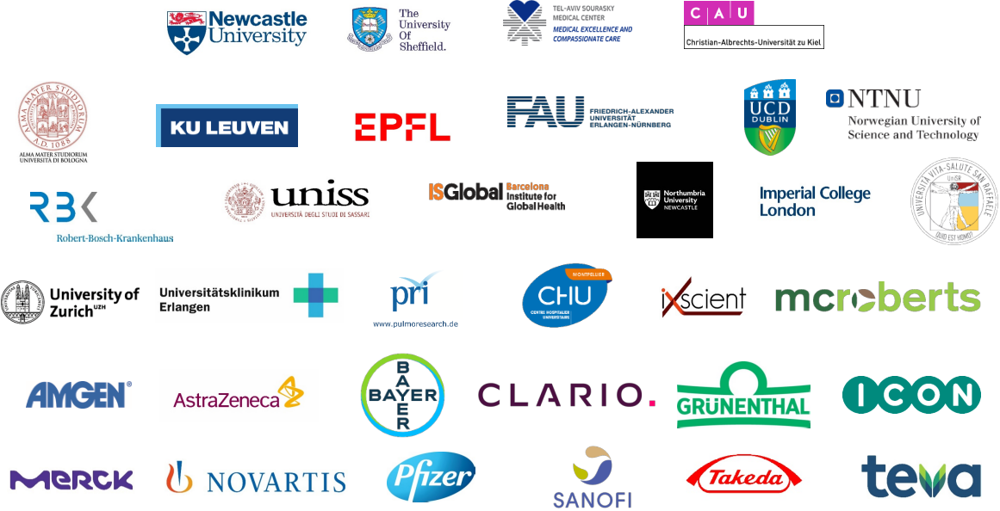

> [!NOTE]
> We recently released Mobgap 1.0, marking the first release with fully re-validated algorithms!
> We highly recommend updating to the 1.0 release. We will not actively support versions < 1.0
> 
> To learn more about the revalidation of the algorithms, visit [the documentation](https://mobgap.readthedocs.io/en/latest/auto_revalidation/index.html).


<p align="center">

</p>

[](https://pypi.org/project/mobgap/)
[](https://mobgap.readthedocs.io/en/latest/?badge=latest)
[](https://doi.org/10.5281/zenodo.14035833)
[](https://codecov.io/gh/mobilise-d/mobgap)
[](https://github.com/mobilise-d/mobgap/actions/workflows/test-and-lint.yml)


# MobGap - The Mobilise-D algorithm toolbox

A Python implementation of the Mobilise-D algorithm pipeline for gait analysis using IMU worn at the lower back
(Learn more about [the Mobilise-D project](https://mobilise-d.eu)).
This package is meant as reference implementation for research and production use.

We are open to contributions and feedback, and are actively interested in expanding the library beyond its current scope
and include algorithms and tools, that would allow mobgap to grow into a general purpose library for gait and mobility
analysis.


## Installation

First install a supported Python version (3.9 or higher) and then install the package using pip.

```bash
pip install mobgap
```

### From Source

If you need the latest unreleased version of mobgap, install the package using pip (or poetry) with the git repository URL


```bash
pip install "git+https://github.com/mobilise-d/mobgap.git" --upgrade
```

If you run into problems, clone the repository and install the package locally.

```bash
git clone https://github.com/mobilise-d/mobgap.git
cd mobgap
pip install .
```

Or the equivalent commands of the python package manager you are using to install local dependencies.

## Citing

If you are using mobgap in your research or work, we would like to ask you to mention the library in your publications.
For papers, we recommend citing the library using the following reference:

```
Küderle, A., Tasca, P., Bicer, M., Kirk, C., Megaritis, D., Hinchliffe, C., Stihi, A., Muecke, A., Babar, Z., Kluge, F., Mueller, 
A., Mazzà, C., Del Din, S., Cereatti, A., Rochester, L., Rooks, D., & Caulfield, B. 
MobGap [Computer software]. https://doi.org/10.5281/zenodo.14035833 URL: https://github.com/mobilise-d/mobgap/ 
```

```
@software{Kuderle_MobGap,
   author = {Küderle, Arne and Tasca, Paolo and Bicer, Metin and Kirk, Cameron and Megaritis, Dimitrios and Hinchliffe, Chloe and
    Stihi, Alexandru and Muecke, Annika and Babar, Zamal and Kluge, Felix and Mueller, Arne and Mazzà, Claudia 
    and Del Din, Silvia and Cereatti, Andrea and Rochester, Lynn and Rooks, Daniel and Caulfield, Brian},
   license = {Apache-2.0},
   title = {{MobGap}},
   url = {https://github.com/mobilise-d/mobgap/}
   doi = {10.5281/zenodo.14035833},
 }
```

For concrete examples on how to cite the library in your work, see the [Usage Recommendation](#usage-recommendation) 
section below.

## Usage Recommendation

The package is designed to be used in two modes:

1. Usage as a full end-to-end pipeline:

   We provide high level pipelines that take in raw sensor data and output final gait parameters on a walking bout
   level, and on various aggregation levels (e.g. per day or per week).
   These pipelines were validated as part of the Technical Validation Study of Mobilise-D and are the **recommended**
   way to obtain gait parameters according to the Mobilise-D algorithms.
   Depending on the clinical cohort and the amount of gait impairment, we recommend different pipelines.
   When using the pipelines in the recommended way, you can expect error ranges as reported in [[1]].
   Outside, this recommended use case, we cannot provide any supported evidence about the correctness of the results.

   If you are using the pipelines in this way, we recommend citing [[1], [2]] and mobgap [[3]] itself as follows:
   
   > Gait parameters were obtained using the Mobilise-D algorithm pipeline [[1], [2]] in its official implementation
   > provided with the mobgap Python library [[3]] version {insert version you used}.

   In general, we would like to ask you to be precise about the version of the mobgap library you used and only
   use the term "Mobilise-D algorithm pipeline" if you used the pipelines as described in the technical validation
   study and not when you just use individual algorithms (see point 2) or use the pipelines with modified parameters.

   In the latter case, we recommend the following citation:

   > Gait parameters were obtained using an approach inspired by Mobilise-D algorithm pipeline [[1], [2]].
   > The algorithm pipeline was implemented based on {name of Pipeline class} available as part of the mobgap Python
   > library [[3]] version {insert version you used} with the following modifications:
   > {insert modifications you made}.
   
   ```
   [1] Kirk, C., Küderle, A., Micó-Amigo, M.E. et al. Mobilise-D insights to estimate real-world walking speed in 
   multiple conditions with a wearable device. Sci Rep 14, 1754 (2024). 
   https://doi.org/10.1038/s41598-024-51766-5
   
   [2] Micó-Amigo, M., Bonci, T., Paraschiv-Ionescu, A. et al. Assessing real-world gait with digital technology? 
   Validation, insights and recommendations from the Mobilise-D consortium. J NeuroEngineering Rehabil 20, 78 (2023). 
   https://doi.org/10.1186/s12984-023-01198-5
   
   [3] Küderle, A., Tasca, P., Bicer, M., Kirk, C., Megaritis, D., Hinchliffe, C., Stihi, A., Muecke, A., Babar, Z., Kluge, F., Mueller, 
   A., Mazzà, C., Del Din, S., Cereatti, A., Rochester, L., Rooks, D., & Caulfield, B. 
   MobGap [Computer software]. https://doi.org/10.1177/0894439316660340 URL: https://github.com/mobilise-d/mobgap/ 
   ```

2. Usage of individual algorithms:

   Besides the pipelines, we also provide individual algorithms to be used independently or in custom pipelines.
   This can be helpful to build highly customized pipelines in a research context.
   But be aware that for most algorithms, we did not perform a specific validation outside the context of the official
   pipelines.
   Hence, we urge you to perform thorough validation of the algorithms in your specific use case.

   If you are using individual algorithms in this way, we recommend citing the original papers the algorithms were
   proposed in and mobgap as a software library.
   You can find the best references for each algorithm in the documentation of the respective algorithm.

   > Gait parameters were obtained using the {name of algorithm} algorithm [algo-citation] as implemented in the
   > mobgap Python library [[3]] version {insert version you used}.

   ```
   [3] Küderle, A., Tasca, P., Bicer, M., Kirk, C., Megaritis, D., Hinchliffe, C., Stihi, A., Muecke, A., Babar, Z., Kluge, F., Mueller, 
   A., Mazzà, C., Del Din, S., Cereatti, A., Rochester, L., Rooks, D., & Caulfield, B. 
   MobGap [Computer software]. https://doi.org/10.1177/0894439316660340 URL: https://github.com/mobilise-d/mobgap/ 
   ```

[1]: https://doi.org/10.1038/s41598-024-51766-5
[2]: https://doi.org/10.1186/s12984-023-01198-5
[3]: https://github.com/mobilise-d/mobgap/

## Used by

<p float="left">
     
   
   
   

</p>  

While mobgap is a relatively young project, it is used in multiple projects and by multiple companies.
Below a list (in no particular order) of projects and companies that use mobgap:

- [Mobilise-D](https://mobilise-d.eu): (obviously)
- [ActiGraph](https://theactigraph.com): [Learn
more](https://blog.theactigraph.com/blog/mobilise-d-algorithms-centrepoint-integration)
- [Empatica](https://www.empatica.com): [Learn
more](https://www.empatica.com/blog/empatica-announces-integration-of-mobilise-d-mobility-outcomes,-advancing-toward-unified-solution-for-clinical-professionals.html)
- [McRoberts](https://www.mcroberts.nl): [Learn more](https://www.mcroberts.nl/)

If you are using mobgap in your project or company and would like to be listed here, please let us know via Github 
Issues or Email.

## License and Usage of Names

The library was developed under the lead of the Friedrich-Alexander-Universität Erlangen-Nürnberg (FAU) as part of 
[the Mobilise-D project](https://mobilise-d.eu). 
The original copyright lies with the Machine Learning and Data Analytics Lab
([MAD Lab](https://www.mad.tf.fau.de/)) at the FAU (See [NOTICE](./NOTICE)).
For any legal inquiries regarding copyright, contact 
[Björn Eskofier](https://www.mad.tf.fau.de/person/bjoern-eskofier/).
Copyright of any community contributions remains with the respective code authors.

The mobgap library is licensed under an Apache 2.0 license.
This means it is free to use for any purpose (including commercial use), but you have to include the license text
in any distribution of the code.
See the [LICENSE](./LICENSE) file for the full license text.

Please note that this software comes with no warranty, all code is provided as is.
In particular, we do not guarantee any correctness of the results, algorithmic performance or any other properties
of the software.
This software is not a medical product nor licensed for medical use.

Neither the name "Mobilise-D" nor "mobgap" are registered trademarks.
However, we ask you to use the names appropriately when working with this software.
Ideally, we recommend using the names as described in the usage recommendation above and not use the name 
"Mobilise-D algorithm pipeline" for any custom pipelines or pipelines with modified parameters.
If in doubt, feel free ask using the [Github issue tracker](https://github.com/mobilise-d/mobgap/issues) or 
the Github discussions.


## Development Setup

If you are planning to make any changes to the code, follow 
[this guide](https://mobgap.readthedocs.io/en/latest/guides/developer_guide.html)

To run typical development tasks, you can use the provided [poethepoet](https://github.com/nat-n/poethepoet) commands:

```
>>> poetry run poe
...
CONFIGURED TASKS
  format                      
  format_unsafe               
  lint                        Lint all files with ruff.
  ci_check                    Check all potential format and linting issues.
  test                        Run Pytest with coverage.
  test_ci                     Run Pytest with coverage and fail on missing snapshots.
  docs                        Build the html docs using Sphinx.
  docs_clean                  Remove all old build files and build a clean version of the docs.
  docs_linkcheck              Check all links in the built html docs.
  docs_preview                Preview the built html docs.
  version                     Bump the version number in all relevant files.
  conf_jupyter                Add a new jupyter kernel for the project.
  remove_jupyter              Remove the project specific jupyter kernel.
  update_example_data         Update the example data registry.
```

Before you push, you should run the `format`, `lint` and `test` task to make sure your code is in a good state.

### Note about tests

Some of the tests can only be executed when certain data is available.
To make sure that the tests concerning the TVS dataset are run, you need to export an environment variable
with the path to the TVS dataset.

```bash
MOBGAP_TVS_DATASET_PATH="/path/to/tvs/dataset" poe test
```

## Funding and Support

This work was supported by the Mobilise-D project that has received funding from the Innovative Medicines Initiative 2 
Joint Undertaking (JU) under grant agreement No. 820820.
This JU receives support from the European Union‘s Horizon 2020 research and innovation program and the European 
Federation of Pharmaceutical Industries and Associations (EFPIA).
Content in this publication reflects the authors‘ view and neither IMI nor the European Union, EFPIA, or any Associated 
Partners are responsible for any use that may be made of the information contained herein.

And of course, this development was only made possible by the joint work of all Mobilise-D partners.

<p align="center">

</p>
